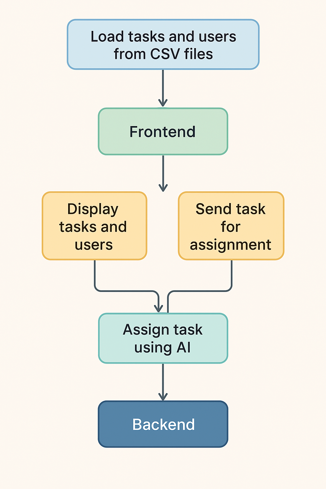

# 🚀 AI Task Allocation System

This project is an AI-powered **task allocation system** that assigns tasks to users based on their skills and task priorities. The backend is built with **FastAPI**, the frontend with **React**, and AI-based task allocation uses **OpenAI**.

---

## 📌 Features

- ✅ **AI-Powered Task Assignment:** Utilizes OpenAI to match tasks to the most suitable users based on skills and priorities.
- ✅ **FastAPI Backend:** Handles task and user data efficiently through REST API endpoints.
- ✅ **React Frontend:** Provides an intuitive interface to display tasks and user allocations.
- ✅ **CSV-Based Storage:** Uses simple CSV files to store task and user information, making it lightweight and Excel-compatible.
- ✅ **Scalability:** Designed to be easily extendable for databases and additional AI models.

This project is an AI-powered **task allocation system** that assigns tasks to users based on their skills and task priorities. The backend is built with **FastAPI**, the frontend with **React**, and AI-based task allocation uses **OpenAI/Gemini API**.


---

## 📌 Solution Approach

Efficient task management is crucial for productivity, yet manual task allocation is often inefficient, biased, and time-consuming. Our AI Task Allocation System aims to solve this by introducing **intelligent, automated task assignment** using AI-driven decision-making.

### 📊 AI Task Allocation Flowchart

To better understand the process, refer to the flowchart below:



### **Thought Process Behind the Solution**

1. **Identifying the Problem:**

   - In many organizations, tasks are assigned manually, leading to **inefficiencies, workload imbalances, and human bias**.
   - A **data-driven, AI-powered** approach can **objectively** match tasks to the best-suited individuals.

2. **Defining Key Requirements:**

   - The system should be **lightweight and easy to integrate**, so we opted for **CSV files** as the initial data source.
   - It should be **scalable**, allowing future enhancements like **database integration or advanced AI models**.

3. **Designing the Allocation Strategy:**

   - AI models (OpenAI/Gemini) analyze **task descriptions and priority levels** to determine required skills.
   - The system **cross-references** tasks with user skill sets and past assignments to find the most suitable candidate.
   - The **allocation algorithm considers workload balancing**, ensuring fair task distribution.

4. **Ensuring Usability & Real-Time Updates:**
   - A **FastAPI backend** processes tasks and user data efficiently.
   - A **React frontend** provides a **clear, interactive interface** for viewing task assignments in real-time.
   - AI-driven decisions are **transparent** and can be manually adjusted if needed.

### **Why This Approach?**

✅ **Eliminates Human Bias** – AI assigns tasks based on skill matching rather than subjective judgment.  
✅ **Saves Time & Effort** – Automates the tedious process of task allocation.  
✅ **Optimizes Productivity** – Ensures that the right person gets the right task at the right time.

This approach provides a **scalable, intelligent task management system** that significantly enhances efficiency while being adaptable to future improvements. 🚀

---

## 🛠️ Implementation Details

To build the AI Task Allocation system, we used:

- **Backend:** FastAPI (Python) – for handling API requests and managing task/user data.
- **Frontend:** React with Chakra UI – for an intuitive user interface.
- **AI Integration:** OpenAI API / Gemini API – for intelligent task allocation.
- **Storage:** CSV files – for lightweight, Excel-compatible data storage.

The system is designed for **scalability**, allowing easy integration with databases and advanced AI models.

---

## ⚡ Execution Steps

To run the system, follow these steps:

### 1️⃣ Clone the Repository

```sh
git clone https://github.com/YOUR_GITHUB_USERNAME/ai-task-allocation.git
cd ai-task-allocation
```

### 2️⃣ Set Up Backend (FastAPI)

```sh
cd backend
pip install -r requirements.txt
uvicorn main:app --reload
```

📍 The backend runs at [http://127.0.0.1:8000](http://127.0.0.1:8000)

### 3️⃣ Set Up Frontend (React)

```sh
cd frontend
npm install
npm start
```

📍 The frontend runs at [http://localhost:3000](http://localhost:3000)

---

## 📦 Dependencies

Ensure you have the following installed before running the project:

- **Python 3.x** (for FastAPI backend)
- **Node.js & npm** (for React frontend)
- **FastAPI & Uvicorn** (backend framework and server)
- **Chakra UI** (for frontend styling)
- **OpenAI/Gemini API Key** (for AI task assignment)
- **CSV files** (for task and user data storage)

---

## ✅ Expected Output

Once the system is up and running, you can expect:

1. **Task and User Management:** View all tasks and users through API endpoints or the frontend UI.
2. **AI-Based Task Assignment:** The system will intelligently assign tasks to the most suitable users based on skill matching.
3. **Seamless Frontend Experience:** Users can view tasks, assignments, and status updates in real-time through the React UI.
4. **Scalable & Extendable Solution:** The system can be modified to include databases or more advanced AI models if needed.

This AI-powered task allocation system simplifies and optimizes task management, ensuring effective and efficient workflow distribution.
